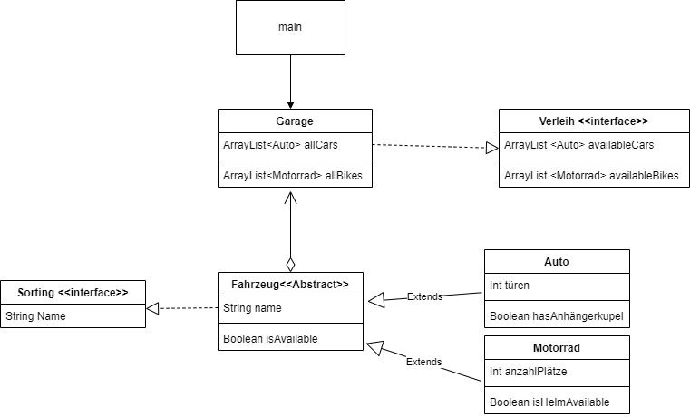
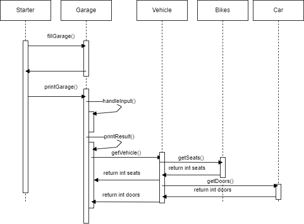
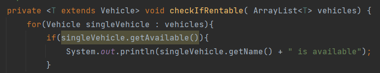

# Modul_213_K08_JaSch

##Project
My small program should simply show some cars and bikes to rent.
In a first step the used should be able to choose if he/she wants to 
view the cars or the bikes. Afterwards the user should see the chosen options
with the according values. In the first stage the programmer has to change the 
availability by hand. Also, cars or bikes need to added by hand. 
By choosing the rent option the cars and bikes get sorted via the comparable interface.
The Vehicles also get loaded via an interface which includes a method the get all 
vehicles that are available.

##UML 

##Sequenz-Diagramm

##Reflexion
Due to various circumstances, it turned out that my project was smaller than I had hoped. 
Since someone in my team was always absent, we were a bit behind schedule. In the end, 
my own project suffered somewhat. Nevertheless, I was able to implement the project as I had imagined. 
It was especially important to me to add at least one new component that I hadn't used before. 
So it happened that my program was a collection of K01-K07. In the example below, the "Generic T" is used. 
I have never actively used this before. 
In this project I have used it, so that I can send different "classes" and that T Vehicle extended can only 
be processed Car or Bike. In addition, I was able to improve my knowledge of Java through these jobs.

###Example Generic T

